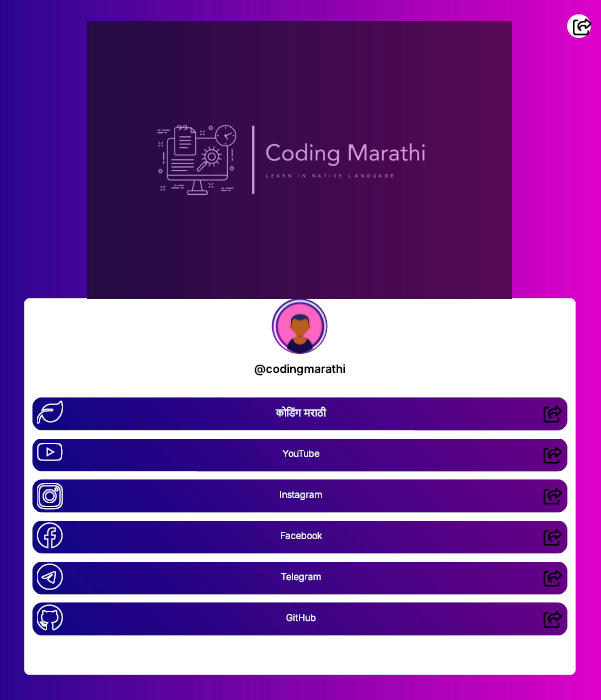

# 🚀 Social Media LinkHub (Linktree Clone)

A clean, customizable, and responsive landing page to showcase all your important links — portfolio, blog, resume, social profiles — all in one place.

Built using **HTML** and **SASS**, this project is perfect for anyone looking to quickly create a personal Linktree-style hub — free and open source.

---

## ✨ Features

- Responsive design for mobile & desktop
- Smooth animations & clean layout
- Easy to customize social links
- Free deployment via GitHub Pages
- No third-party services or fees

---

## 👨‍💻 Author

- [Mandar (Fawkes73)](https://github.com/Fawkes73)

---

## 📸 Preview Screenshots




---
## Run Locally

Clone the project

```bash
  git clone https://github.com/Fawkes73/social-media-links.git
```

Go to the project directory

```bash
  cd my-project
```

Install Live Server extention on Visual Studio Code

```bash
   by Ritwick Dey
```

Start the server

```bash
  click on the Go Live button on the bottom right side of VS Code
```


## 
🎯 Customize Your Links


To add your own social/media links:

Open index.html

Replace the placeholder href="#" links with your own URLs

Add or remove icons as needed from the template


## 🌐 Deploy on GitHub Pages (Free Hosting)

- Push your project to a GitHub repository

- Go to the repository Settings → Pages

- Under Source, select:

- Branch: main (or master)

- Folder: /root or /docs (depending on setup)

= Save → Wait for GitHub to deploy


## Your site will be live at:
https://your-username.github.io/repo-name/


## License

MIT License

Copyright (c) 2023 Surve Mandar

Permission is hereby granted, free of charge, to any person obtaining a copy of this software and associated documentation files (the "Software"), to deal in the Software without restriction, including without limitation the rights to use, copy, modify, merge, publish, distribute, sublicense, and/or sell copies of the Software, and to permit persons to whom the Software is furnished to do so, subject to the following conditions:

The above copyright notice and this permission notice shall be included in all copies or substantial portions of the Software.

THE SOFTWARE IS PROVIDED "AS IS", WITHOUT WARRANTY OF ANY KIND, EXPRESS OR IMPLIED, INCLUDING BUT NOT LIMITED TO THE WARRANTIES OF MERCHANTABILITY, FITNESS FOR A PARTICULAR PURPOSE AND NONINFRINGEMENT. IN NO EVENT SHALL THE AUTHORS OR COPYRIGHT HOLDERS BE LIABLE FOR ANY CLAIM, DAMAGES OR OTHER LIABILITY, WHETHER IN AN ACTION OF CONTRACT, TORT OR OTHERWISE, ARISING FROM, OUT OF OR IN CONNECTION WITH THE SOFTWARE OR THE USE OR OTHER DEALINGS IN THE SOFTWARE.
